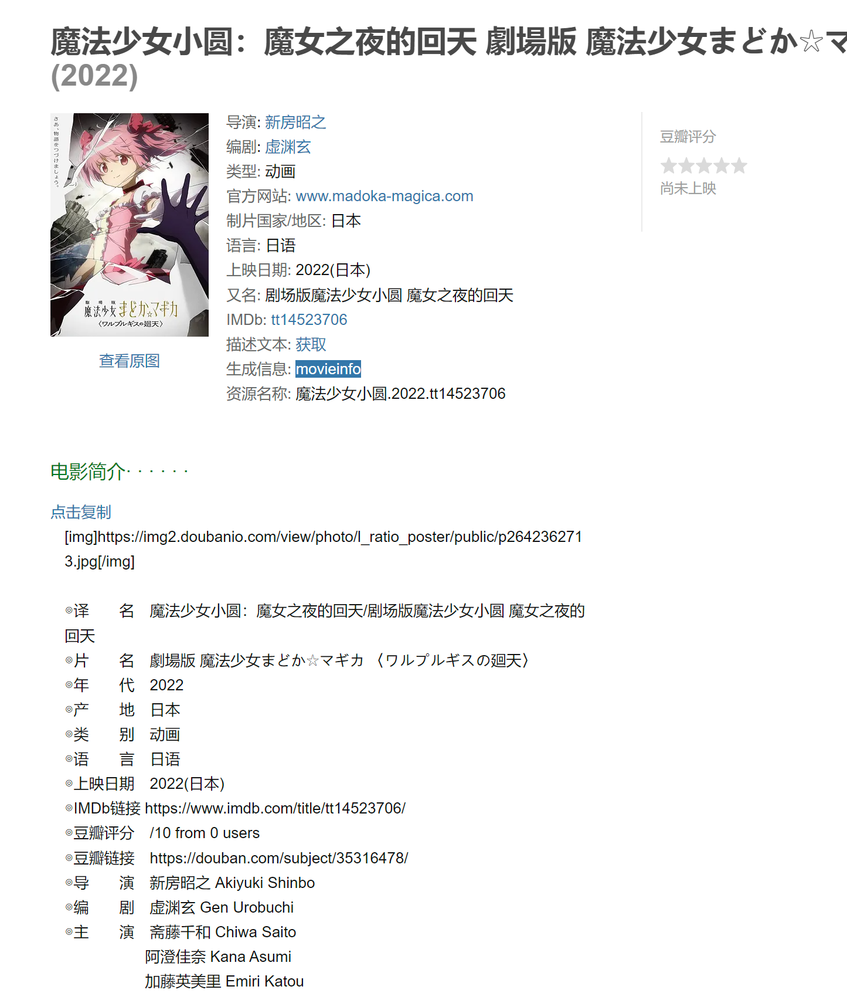

# PART 2 简介

### 工具

**建议动漫优先使用Bangumi简介，影视使用Douban**

[**PT-gen**](https://github.com/Rhilip/pt-gen-cfworker)：快速生成简介的工具

[**豆瓣资源下载大师**](https://greasyfork.org/zh-CN/scripts/329484-%E8%B1%86%E7%93%A3%E8%B5%84%E6%BA%90%E4%B8%8B%E8%BD%BD%E5%A4%A7%E5%B8%88-1%E7%A7%92%E6%90%9E%E5%AE%9A%E8%B1%86%E7%93%A3%E7%94%B5%E5%BD%B1-%E9%9F%B3%E4%B9%90-%E5%9B%BE%E4%B9%A6%E4%B8%8B%E8%BD%BD)：快速生成豆瓣简介的油猴脚本



[**Bangumi - Info Export**](https://github.com/Rhilip/PT-help/blob/master/docs/js/Bangumi%20-%20Info%20Export.user.js)：快速生成Bangumi简介的油猴脚本

进入资源详情界面，自动生成并复制到剪贴板

### _**示例1 Bangumi**_

**直接使用工具生成的排版**

**效果如下**


```
[img]//lain.bgm.tv/pic/cover/l/21/a1/292238_u43yn.jpg[/img]

[b]STORY : [/b]
桐人、尤吉欧、爱丽丝。距离两名修剑士和一名整合骑士打败了最高祭司阿多米尼斯多雷特已过去了半年。
结束了战斗，爱丽丝在故乡卢利特村生活。在她的身旁，是失去了挚友，自己也失去了手臂和心的桐人。献身般支撑着他的爱丽丝，丝毫没有保留像以前一样作为骑士的心。“告诉我，桐人……我究竟该怎么办？”
然而，通往将 Underworld 全境引向悲剧的“最终压力测试”的倒计时，却毫不留情地推进着。仿佛与之相呼应一般，在“黑暗领域”的深处，暗黑神贝库达复活了。他率领暗黑帝国的军队，为了得到“光之巫女”，开始向“人界”进攻。
指挥“人界”军队的贝尔库利等人，决心与“黑暗领域”的军队展开前所未有的大战。但在他们身旁，并没有发现爱丽丝，以及拯救了“人界”的两位...

[b]STAFF : [/b]
原作: 川原礫（「電撃文庫」刊）
导演: 小野学
脚本: 漆原虹平、中本宗応
分镜: 小野学、佐久間貴史、菅野芳弘、中重俊祐、みうらたけひろ、森本育郎、中山奈緒美、古田丈司、小原正和、山田晃、大塚健
演出: みうらたけひろ、山田晃、ほりうちゆうや、中重俊祐、濱崎徹、小原正和、佐久間貴史、田中智也
音乐: 梶浦由記
人物原案: abec(BUNBUN)
人物设定: 足立慎吾、鈴木豪、西口智也、山本由美子、戸谷賢都
美术监督: 渡辺佳人、小川友佳子

[b]CAST : [/b]
桐人／桐谷和人 : 松岡禎丞
爱丽丝·滋贝鲁库／爱丽丝·辛赛西斯·萨提 : 茅野愛衣
亚丝娜／结城明日奈 : 戸松遥
诗乃／朝田诗乃 : 沢城みゆき
莉兹贝特／篠崎里香 : 高垣彩陽
西莉卡／绫野圭子 : 日高里菜
莉法／桐谷直叶 : 竹達彩奈
结衣 : 伊藤かな恵
克莱因／壶井辽太郎 : 平田広明

(来源于 https://bgm.tv/subject/292238 )
```

### _**示例2 Douban**_

因为np网站显示bug，故给出一个美化版排版规范。如下，**仅供参考，建议还是直接用工具生成的**

第一行为图片，空一行，每个小标题后不空行, 演员之间用**"** / **"**分割

**标题间以及标题后的第一个**空格，使用**全角(em, U+2003)空格"**　**"**以对齐

```
[img]https://img1.doubanio.com/view/photo/l_ratio_poster/public/p2874119367.jpg[/img]

译　　名　西部世界 第四季/西方极乐园(台)
片　　名　Westworld Season 4
年　　代　2022
产　　地　美国
类　　别　剧情/科幻/悬疑
语　　言　英语
上映日期　2022-06-26(美国)
IMDb评分　7.4/10 from 2327 users
IMDb链接　https://www.imdb.com/title/tt12191076/
豆瓣评分　8.2/10 from 3220 users
豆瓣链接　https://douban.com/subject/35042913/
集　　数　8
片　　长　60分钟
导　　演　理查德·J·刘易斯 Richard J. Lewis / 克雷格·麦克尼尔 Craig Macneill
编　　剧　丽莎·乔伊 Lisa Joy / 乔纳森·诺兰 Jonathan Nolan / 迈克尔·克莱顿 Michael Crichton / 克里斯蒂娜·哈姆 Christina Ham / Matt Pitts Matt Pitts / Will Soodik Will Soodik
主　　演　埃文·蕾切尔·伍德 Evan Rachel Wood / 坦迪·牛顿 Thandiwe Newton / 杰弗里·怀特 Jeffrey Wright / 亚伦·保尔 Aaron Paul / 艾德·哈里斯 Ed Harris / 詹姆斯·麦斯登 James Marsden / 吴彦祖 Daniel Wu / 曼尼·蒙塔纳 Manny Montana / 阿丽亚娜·德博斯 Ariana DeBose / 奥罗拉·佩里诺 Aurora Perrineau / 吉姆·科迪·威廉姆斯 Jim Cody Williams / 丽贝卡·拉迪西奇 Rebecca Radisic / 泰莎·汤普森 Tessa Thompson / 卢克·海姆斯沃斯 Luke Hemsworth / 安吉拉·萨拉弗安 Angela Sarafyan / 莉莉·西蒙斯 Lili Simmons
简　　介　第四季将讲述一群机器人，在偏离程序员所设计的剧本后所发生的一些异常行为的故事。
```


